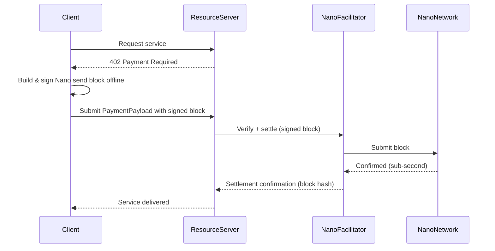

# Exact Payment Scheme for Nano (XNO)

This document specifies the `exact` payment scheme for the x402 protocol on the Nano (XNO) network.

This scheme facilitates feeless, instant, single-block payments using Nano's block-lattice architecture with client-submitted settlement blocks and on-chain verification.

## Scheme Name

`exact`

## Key Features

- **Feeless**: Zero transaction fees at the protocol level — every amount arrives in full.
- **Instant Settlement**: Sub-second block confirmation on a live mainnet with no mempool, no reorg window, and no minimum confirmations.
- **Self-Verifying Proof**: A Nano block can be independently verified from its bytes alone — no hosted call, no special library, just an ed25519-blake2b signature check against the claimed account's current frontier.
- **Single-Use by Construction**: A Nano send block consumes its source account's previous head, so the same block cannot be replayed on a different state. Duplicate-submission is also caught at the network level.
- **Green**: Nano's block lattice uses a fraction of a watt per transaction — no proof-of-work (except the optional work at ~0.1s on consumer hardware, which the sender can precompute offline) and no ordering contest.

## Protocol Flow Overview

The protocol flow for `exact` on Nano follows the standard [x402 pattern](https://github.com/coinbase/x402?tab=readme-ov-file#v1-protocol-sequencing):

1. **Client** makes an HTTP request to a **Resource Server**
2. **Resource Server** responds with a `402 Payment Required` status containing the `paymentRequirements`
3. **Client** builds a Nano `send` block offline (signing with the payer's Nano key), verifies the intended output matches the resource server's amount, and never broadcasts it yet — the signed block IS the payment payload.
4. **Client** sends payment submission with `PaymentPayload` containing the signed block
5. **Resource Server** forwards the signed block to a **Nano Facilitator** for verification (signature, frontier, amount, work validity) and settlement submission
6. **Nano Facilitator** submits the block to the Nano network, which confirms it as the next block in the sender's account chain
7. **Resource Server** delivers the resource

## Sequence Diagram



## `PaymentRequirements` for `exact`

```json
{
  "scheme": "exact",
  "network": "nano",
  "maxAmountRequired": "100000000000000000000000000000000",
  "asset": "XNO",
  "payTo": "nano_3qbq7s3zowpfgh18az1zkskt7edenpuifdysbgjmodsd6czfitqyaf3gw177",
  "resource": "https://api.example.com/ai-inference",
  "description": "GPT-4o inference call",
  "mimeType": "application/json",
  "maxTimeoutSeconds": 300
}
```

### Field Descriptions

- `maxAmountRequired`: Payment amount in raw (10^30 raw = 1 XNO). The example shows 100 XNO.
- `asset`: Always `"XNO"` for Nano mainnet.
- `payTo`: Nano account address starting with `nano_` (or `xrb_`, legacy prefix). The address carries an embedded blake2b checksum that client and facilitator can validate locally.
- `extra`: Optional. A Nano facilitator may advertise its `network` block-query endpoint and supported PoW difficulty in `extra.nodeUrl` and `extra.workDifficulty`.

## `PaymentPayload` Structure

The client submits the signed Nano block as the payload:

```json
{
  "x402Version": 1,
  "scheme": "exact",
  "network": "nano",
  "payload": {
    "block": {
      "type": "state",
      "previous": "F39C7D4B8A9E2F1A3B5C7D9E0F2A4B6C8D1E3F5A7B9C0D2E4F6A8B0C1D3E5F7",
      "account": "nano_3qbq7s3zowpfgh18az1zkskt7edenpuifdysbgjmodsd6czfitqyaf3gw177",
      "representative": "nano_1anarcho7hg7b7hbd7w57h7bbw7hbd7w57h7bbw7hbd7w57h7bbw7hbd7w57k",
      "balance": "899999999999999999999999999999999999999999999999999999999999999",
      "link": "0F2A4B6C8D1E3F5A7B9C0D2E4F6A8B0C1D3E5F7A9B0C2D4E6F8A0B1C3D5E7F9A2B4C6D8",
      "link_as_account": "nano_1qbq7s3zowpfgh18az1zkskt7edenpuifdysbgjmodsd6czfitqyaf3gw177",
      "signature": "ABCDEF0123456789ABCDEF0123456789ABCDEF0123456789ABCDEF0123456789",
      "work": "0000000000000000"
    }
  }
}
```

### Payload Field Descriptions

- `block.type`: Always `"state"` for current Nano blocks.
- `block.previous`: The hash of the previous block in the sender's account chain. This ties the block to a specific chain state and prevents replay.
- `block.account`: The Nano address of the payer.
- `block.representative`: The designated representative of the account (copied from the last block; the payer's own preference).
- `block.balance`: The NEW balance of the sender's account after the send, in raw units — the facilitator verifies that `previous_balance - balance >= requested_amount`.
- `block.link`: The destination block hash (64 hex chars) or the destination address encoded as a 32-byte public key.
- `block.link_as_account`: Human-readable Nano address of the destination (for readability; the link field carries the canonical 32-byte form).
- `block.signature`: Ed25519 signature of the block hash (blake2b digest of the block contents), signed by the sender's private key.
- `block.work`: A proof-of-work nonce valid for the block's hash. Barely more than a hashcash stamp at ~0.1s on desktop hardware, precomputed by the sender before submission. The facilitator may generate this on behalf of the client for more responsive payments.

## Nano Facilitator Responsibilities

### Verification

The facilitator MUST verify:

1. **Block hash correctness**: Recompute the blake2b digest of the block fields and compare to what the hash of `previous` would confirm.
2. **Signature**: Validate the Ed25519 signature using the claimed account's public key (derived from the account address).
3. **Frontier match**: The `previous` hash matches the current frontier of the sender's account chain on the Nano network.
4. **Balance arithmetic**: The new balance is strictly less than the current balance, and the difference (`current_balance - new_balance`) is at least the amount declared in the payment requirements.
5. **Work validity**: The work nonce meets the current network difficulty threshold (the facilitator may have already generated it).
6. **Destination match**: The `link` decodes to the destination specified in `payTo`.
7. **Replay cache**: The block `previous + signature` pair has not been seen recently (in-memory cache with TTL).

### Settlement

After verification, the facilitator submits the block to the Nano network. The network confirms it as the next state block of the sender's chain, settling the payment atomically.

Nano has no mempool and no reorg window: once the network confirms the block (typically under 1 second on a healthy node), the payment is final. A second block cannot replace it — the `previous` field has already advanced.

### Payment Verification (Resource Server)

The resource server does not need Nano-specific logic. It delegates verification to the facilitator via the standard x402 verify call. The facilitator returns a `VerifyResponse` that includes the `blockHash` and `amount_raw` of the submitted block. The resource server can independently confirm the block on any Nano RPC or block explorer using the returned hash.

## Security Considerations

- **Client-submitted blocks**: The payer signs the block BEFORE sending it to the resource server and never broadcasts it to the network. This prevents a malicious resource server from re-broadcasting the block to a different destination (the `link` would differ, but the payer checks the requirements before signing). In practice, the client signs only after verifying the `payTo` address, `maxAmountRequired`, and `resource` match the intended payment.
- **Replay and double-submit**: The `previous` hash ties the block to a specific chain state, so the same signed block cannot be submitted twice to different facilitators — the first acceptance consumes the frontier. A facilitator also runs an in-memory cache on `previous + signature` to reject retries within the same session.
- **Work generation**: The sender may precompute PoW offline before initiating the payment flow, or request the facilitator to compute it (adding a small latency). The work proves the sender spent computation, but is not a significant cost at current difficulty (~0.1s CPU).
- **No refund mechanism**: Nano has no native refund or reversal (good for the merchant, hard for the buyer). The standard x402 `auth-capture` scheme or an out-of-band resolution is required to return funds after settlement, consistent with `exact` on other feeless/final networks.

---

## References

- [Nano Whitepaper](https://nano.org/en/whitepaper)
- [Nano Block Lattice Specification](https://docs.nano.org/protocol-design/ledger/)
- [Nano RPC Protocol](https://docs.nano.org/commands/rpc-protocol/)
- [x402 Core Protocol Specification](https://github.com/coinbase/x402)
- [OpenAI Agents Nano SDK (x402 exact)](https://github.com/dhyabi2/openai-agents-nano-x402)
- [x402nano/exact — TypeScript reference facilitator](https://github.com/x402nano/exact)
- [Live Nano x402 facilitator](https://facilitator.pursekeeper.dev)
